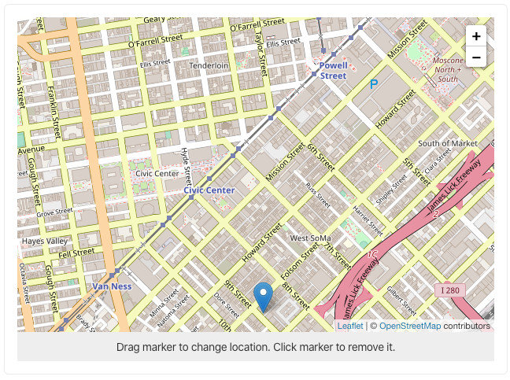
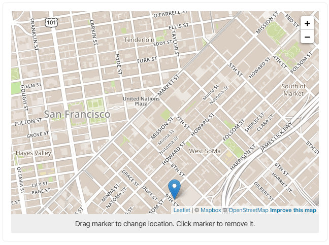

# sanity-plugin-leaflet-input

[Leaflet](https://leafletjs.com/) is an open-source JavaScript library for mobile-friendly interactive maps. This plugin is an input component for [Sanity.io](https://www.sanity.io/) which lets you use the Leaflet library for the [Geopoint](https://www.sanity.io/docs/geopoint-type) schema type.

By default it will use OpenStreetMaps tiles, but it can be configured to use a different provider, such as Mapbox.

## Screenshots

**Using OpenStreetMaps**



**Using MapBox (streets style)**



## Installing

```
sanity install leaflet-input
```

**Note**: If you have another geopoint input installed (such as `@sanity/google-maps-input`), you'll either need to move this plugin below it in your studios `sanity.json` `plugins` array (easiest), or explicitly [importing the input component](#importing-the-component) where you want to use it.

## Configuring

The plugin can be configured both "globally" and "locally".

The global options can be defined in `<your-studio-folder>/config/leaflet-input.json`:

```json
{
  "tileLayer": {
    "attribution": "&copy; <a href=\"http://osm.org/copyright\">OpenStreetMap</a> contributors",
    "url": "https://{s}.tile.openstreetmap.org/{z}/{x}/{y}.png"
  },
  "defaultLocation": {
    "lat": 37.779048,
    "lng": -122.415214
  },
  "defaultZoom": 13
}
```

The same options can be defined on a field level ("local"):

```js
// some-schema-type.js
export default {
  name: 'restaurant',
  type: 'document',
  fields: [
    {
      name: 'location',
      type: 'geopoint',
      options: {
        leaflet: {
          defaultLocation: {
            lat: 59.924095,
            lng: 10.758458,
          },
        },
      },
    },
  ],
}
```

## Using Mapbox

In your studios `config/leaflet-input.json` file (if it's missing, run `sanity start` to generate it):

```json
{
  "tileLayer": {
    "accessToken": "SOME_ACCESS_TOKEN",
    "id": "mapbox.streets",
    "maxZoom": 18,
    "url": "https://api.tiles.mapbox.com/v4/{id}/{z}/{x}/{y}.png?access_token={accessToken}",
    "attribution": "© <a href=\"https://www.mapbox.com/about/maps/\">Mapbox</a> © <a href=\"http://www.openstreetmap.org/copyright\">OpenStreetMap</a> <strong><a href=\"https://www.mapbox.com/map-feedback/\" target=\"_blank\">Improve this map</a></strong>"
  }
}
```

Read more about access tokens [here](https://docs.mapbox.com/help/how-mapbox-works/access-tokens/).

## Importing the component

If you have multiple Geopoint inputs installed, you may need to import the leaflet plugin specifically in the cases where you want to use it:

```js
// some-schema-type.js
import LeafletGeopointInput from 'sanity-plugin-leaflet-input'

export default {
  name: 'restaurant',
  type: 'document',
  fields: [
    {
      name: 'location',
      type: 'geopoint',
      inputComponent: LeafletGeopointInput,
    },
  ],
}
```

## License

MIT © [Espen Hovlandsdal](https://espen.codes/)
